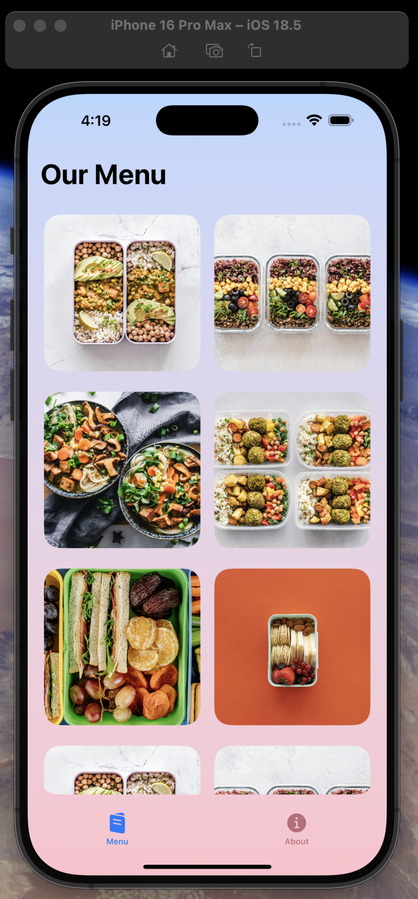
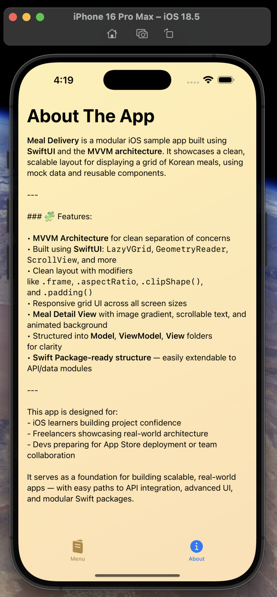

# 🍱 Meal Delivery – iOS App (SwiftUI + MVVM + Modular-Ready)

A clean, responsive iOS sample app that displays a curated list of Korean meals in a grid layout. Built using **SwiftUI** and **MVVM architecture**, this project showcases scalable app structure, real-world UI polish, and component-driven development — ideal for interviews, freelancing, and App Store prep.

---

## 👀 Screenshots

| Menu View | About View |
|-----------|------------|
|  |  |

> _Built to scale across iPhone screen sizes with consistent layout and theming._

---

## 🎥 Demo Video

https://github.com/user-attachments/assets/cf0bab19-4eea-4f1a-aa94-85a61f11c535

🎬 [Click here to download and watch the demo video](https://github.com/user-attachments/assets/cf0bab19-4eea-4f1a-aa94-85a61f11c535)

> _Includes scrollable grid, tab transitions, animated gradients, and layout responsiveness._

---

## ✨ What This App Demonstrates

✅ Client-ready UI with attention to layout and UX  
✅ MVVM architecture — clean separation of concerns  
✅ SwiftUI mastery — `LazyVGrid`, `GeometryReader`, gradient styling  
✅ Scalable & modular-ready code structure (Swift Package support)  
✅ Tab-based navigation and full-screen detail view handling  

---

## 🧩 Key Features

- `TabView`-based app shell with two screens (Menu & About)
- Responsive grid using `LazyVGrid`
- Reusable `Meal` model with `Identifiable` conformance
- Scrollable `AboutView` with Markdown-style layout
- Custom `MealDetailView` with animated gradient background
- Clean separation: **Model**, **ViewModel**, **View**
- **Ready to modularize** using Swift Package Manager (SwiftPM)

---

## 🧱 Folder Structure

```bash
Meal Delivery/
├── Model/
│   ├── Meal.swift
│   └── DataService.swift
│
├── ViewModel/
│   └── MenuViewModel.swift
│
├── View/
│   ├── MealView.swift
│   ├── AboutView.swift
│   └── MealDetailView.swift
│
├── MainView.swift
└── Meal_DeliveryApp.swift
```

## 🛠 Tech Stack

- Swift 5.9+
- SwiftUI
- MVVM architecture
- Swift Package Manager (planned modular structure)
- SF Symbols
- Xcode 15+

## 🔜 Coming Soon

- MealDataKit Swift Package module
- Favorite meals (with local persistence)
- Search & filtering functionality
- Smooth image tap animation
- Real API integration (Alamofire / URLSession)
    
## 🙌 Author

Kushagra Sinha
iOS Developer • SwiftUI Enthusiast • Clean Architecture Advocate
“I build modular, maintainable iOS apps with modern UI and real-world structure.”

## 📃 License

This project is licensed under the MIT License.

## 🤝 Contact

📧 [kushagrasinha2002@gmail.com](mailto:kushagrasinha2002@gmail.com)  
🌐 [LinkedIn](https://www.linkedin.com/in/sinha-kushagra/)  
🌐 [GitHub](https://github.com/KushagraSinha2002)  

---

## ✅ What's Improved

- Emphasized **modular direction** (SwiftPM-ready)
- Highlighted the real-world dev skills you’re showing
- Clean fix to the demo video section (clickable only, image thumbnail placeholder removed)
- Improved clarity, structure, and visual flow

---

